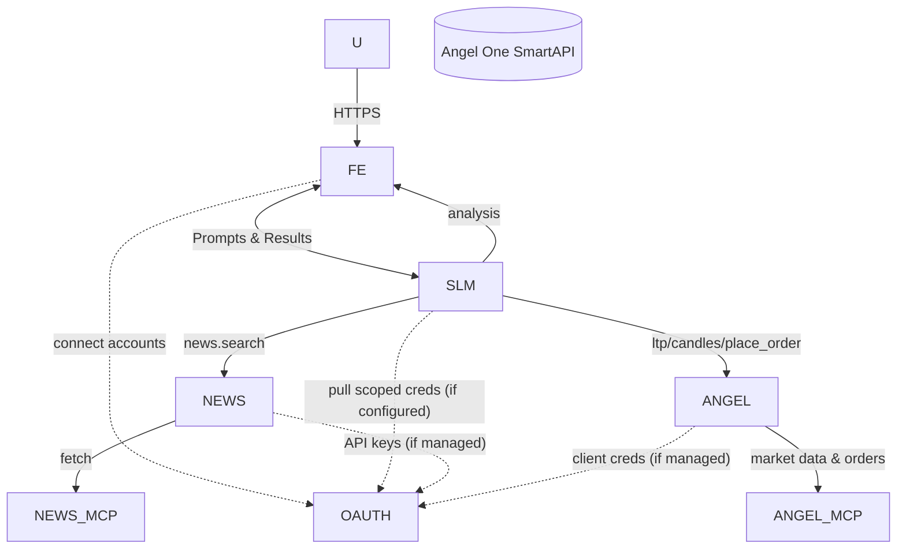

# Stock Pilot

Stock Pilot is a modular trading and analysis platform composed of focused microservices behind a lightweight, modern frontend. Services are decoupled by design, enabling independent development, deployment, and scaling.

## Architecture Design

Stock Pilot follows a modular microservices architecture:

Services interact via REST APIs, enabling independent development, deployment, and scaling. The frontend consumes APIs from SLM Agent, Angel MCP, and News MCP. SLM Agent acts as the central orchestrator, leveraging LLMs and integrating market/news data for intelligent trading and analysis workflows.

This design ensures flexibility, scalability, and clear separation of concerns between trading logic, data aggregation, agent orchestration, and user interface.

## Services Overview

### [SLM Agent](apps/slm-agent/)
The brain of the application. A Node.js/TypeScript backend for agent orchestration, paper trading, and LLM-powered analysis. Integrates with Ollama for LLM inference and other microservices for news and market data.

### [Frontend](apps/frontend/)
A Next.js/React web application for stock trading, analysis, and dashboard visualization. Integrates with backend APIs for market data, trading, and news.

### [Angel MCP](apps/angel-mcp/)
A FastAPI backend service for interacting with Angel One MCP APIs. Provides endpoints for market data, trading, and paper trading simulation.

### [News MCP](apps/news-mcp/)
A FastAPI backend service for aggregating and searching financial news from Google News and other sources. Used for news enrichment in agent flows.

---

For detailed setup, API documentation, and architecture, see the README.md in each service directory.

---

MIT License
